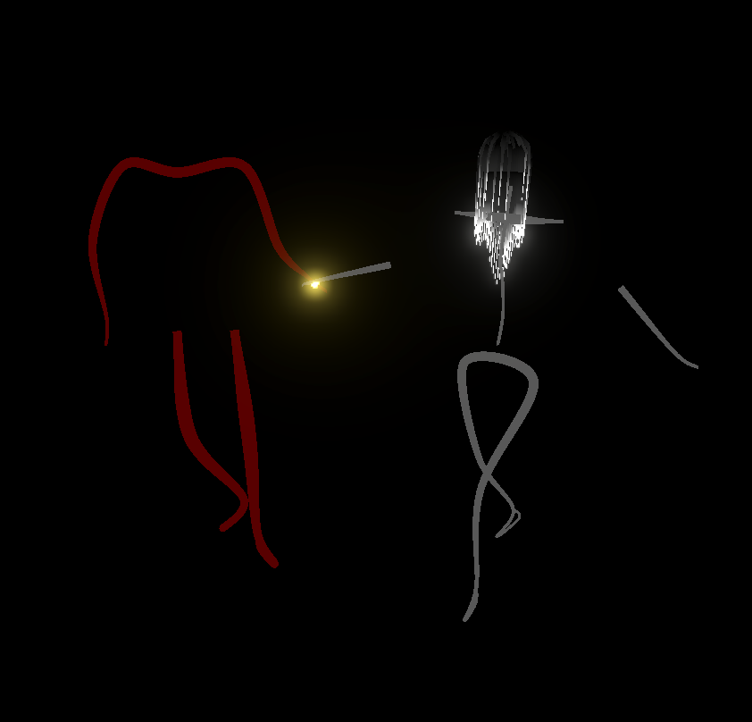

# Head Movement (ZR)

  

An immersive dance environment that plays back 3d dancer poses for educational purposes.

Viewable in VR.

The input format:
Assets/
|
 StreamingAssets/
 |
  LeadFollow1/
  |
   audio.wav (music track)
   figure1.json (3d smpl pose per frame)
   figure2.json (3d smple poses per frame)
   video_meta.json (duration and frame count for consistentcy)
   zouk-time-analysis.json (downbeats and upbeats per fractional second)
  
  LeadFollow2/
  |
   etc....
 
 Keyboard inputs:
 1,2,3,4 etc load dancer performance
 Spacebar to play/pause
