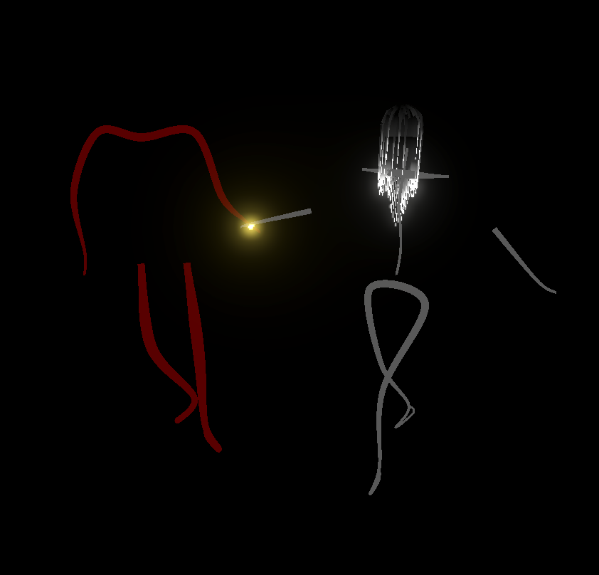

# Head Movement (ZR)

  

An immersive dance environment that plays back 3d dancer poses for educational purposes.

Viewable in VR.

The input format:
Assets/
|
 StreamingAssets/
 |
  LeadFollow1/
  |
   audio.wav (music track)
   figure1.json (3d smpl pose per frame)
   figure2.json (3d smple poses per frame)
   video_meta.json (duration and frame count for consistentcy)
   zouk-time-analysis.json (downbeats and upbeats per fractional second)
  
  LeadFollow2/
  |
   etc....
 
   capture.json (optional, written by ../atlas_bridge: fps, audio_offset, splats, virtual cameras)
   environment.ply (optional 3DGS splat of the room, e.g. from World Labs Atlas)
   splats/frame_00000.ply ... (optional per-frame splats)
   cameras.json (optional virtual camera ring used for MAMMA)

 Folders are listed alphabetically; `python -m atlas_bridge demo` (in ../atlas_bridge) writes
 `00_SyntheticDemo` so there is always something on key 1. beat_this output named
 `<stem>_zouk-time-analysis.json` is also found.

 Keyboard inputs:
 1,2,3,4 etc load dancer performance
 Spacebar to play/pause
 , .  step one zouk beat (pauses)      [ ]  previous / next measure
 L    loop the current measure         R / Home  restart
 <- -> playback speed (0.5x, 0.75x, 1x)
 WASD / QE orbit camera (works while paused)
 F floor patterns   T tension/compression   G splats   C virtual cameras   H HUD

 VR controller: button one play/pause, button two loop measure,
 up/down previous/next measure, left/right speed.

 Floor patterns: every detected step is a glowing footprint, coloured by timing against the
 nearest zouk beat (green <= 45 ms, amber <= 100 ms, red beyond). Upcoming steps are faint.
 Tension/compression: lines from the lead's shoulder/chest through the contact point to the
 follow's centre of mass; orange = tension (pull), blue = compression (push). This is a
 kinematic estimate (see Assets/Physics/PartnerConnection.cs), not measured force.
